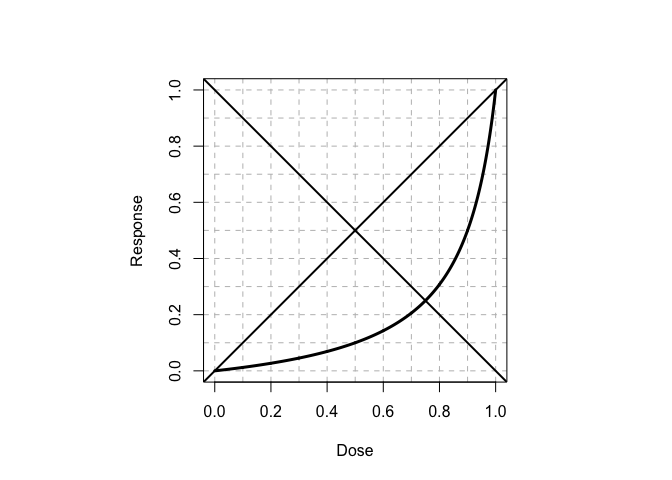

Concavex Dose-Response Curve Fitting
================
4 October 2016

### The Doubly Standardized Concavex Curve

\[ \frac{\left( \frac{1-\lambda}{2} \right)^2 + \lambda}    { \left( \frac{1-\lambda}{2} \right)^2        +\lambda x} \cdot x  \]

### Generalizing to Actual Data

### Bayesian Curve Fitting with Gibbs Sampling via JAGS
