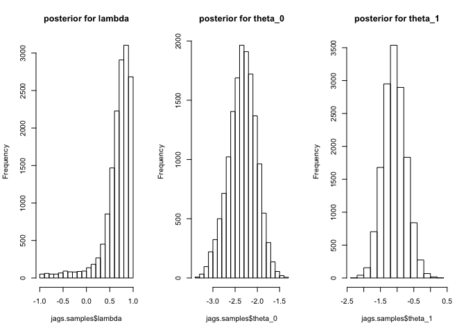
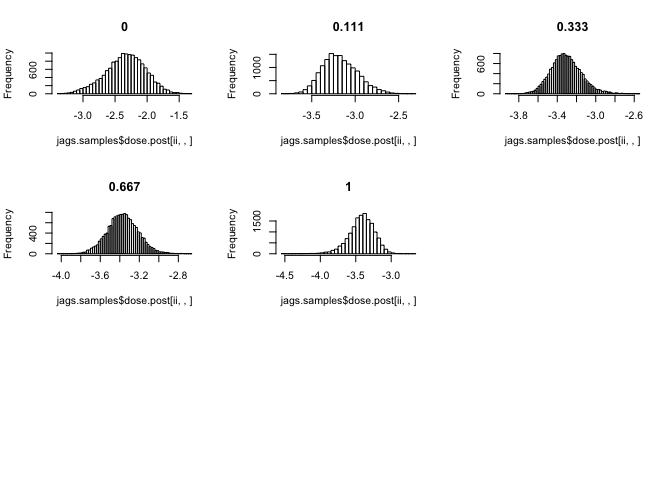
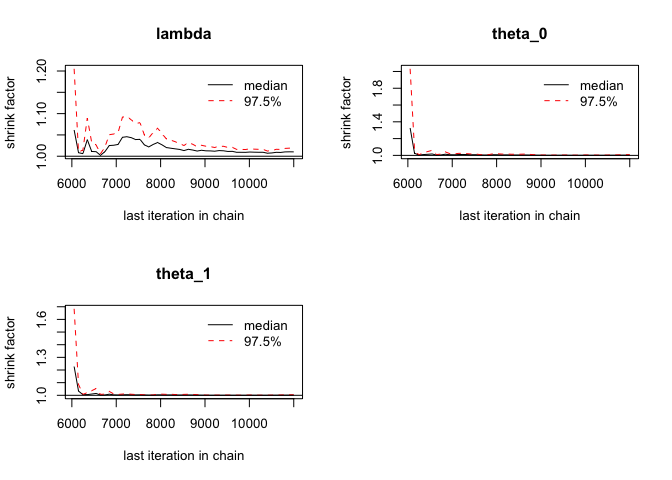
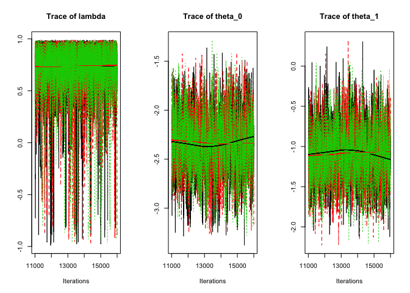
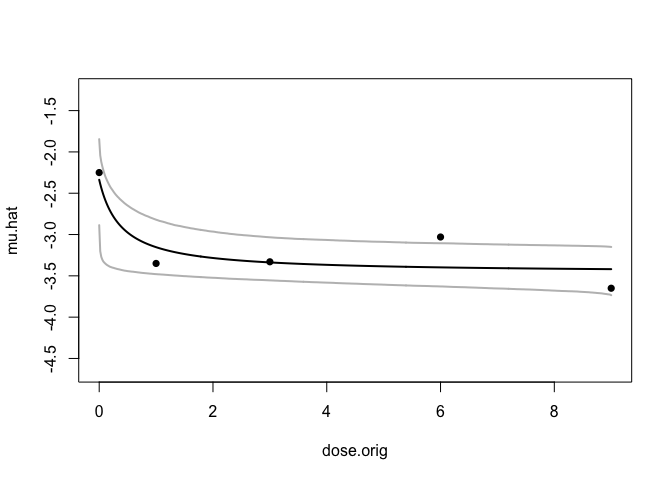
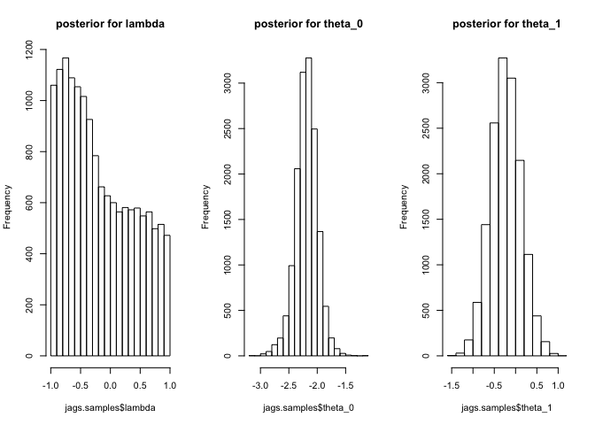
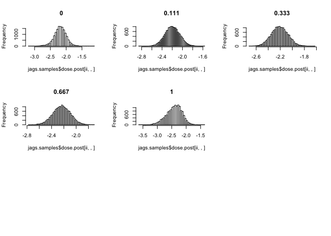
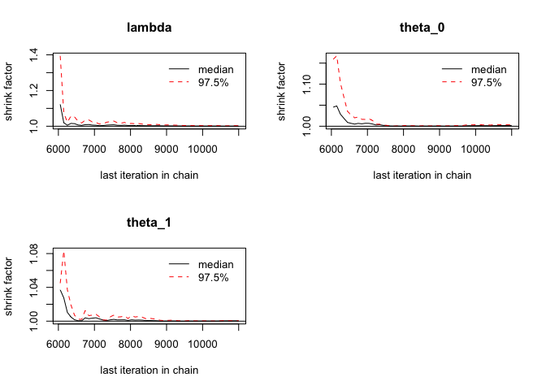
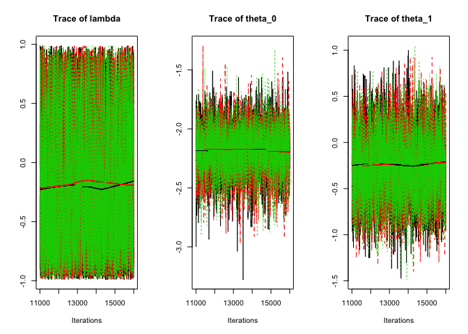
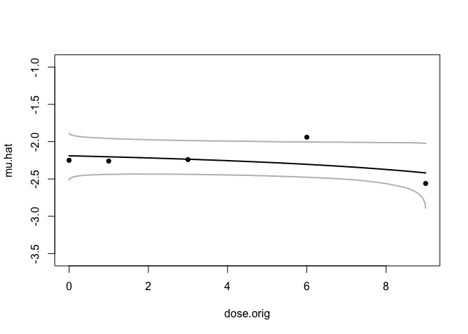

Headache Example
================
October 4, 2016

Regeneron Example
=================

Read data & initialize Gibbs sampler
------------------------------------

``` {.r}
library(rjags)
library(coda)

# read in data ------------------------------------------------------------
dose.orig <- c(0, 1, 3, 6, 9) 
dose <- dose.orig / max(dose.orig)
pred.doses <- seq(0, 1, length.out = 500)
mu.hat <- c(-2.25, -3.35, -3.33, -3.03, -3.65)
var.hat <- rep(2.5^2, 5) / c(83, 85, 84, 85, 84)

# initialize 3 Gibbs Sampling chains --------------------------------------
inits1 <- inits2 <- inits3 <- list(theta_0 = 0, theta_1 = 0, lambda = 0)
inits <- list(inits1, inits2, inits3)

# initialize model --------------------------------------------------------
setwd('..')
setwd('bug')
jags.model <- jags.model('concavex-model.bug',
                             data = list('dose' = dose,
                                         'eff' = mu.hat,
                                         'tau' = 1 / var.hat,      # jags deals in precisions
                                         'pred.doses' = pred.doses),
                             inits = inits, n.chains = 3)
```

    ## Compiling model graph
    ##    Resolving undeclared variables
    ##    Allocating nodes
    ## Graph information:
    ##    Observed stochastic nodes: 5
    ##    Unobserved stochastic nodes: 3
    ##    Total graph size: 9637
    ## 
    ## Initializing model

``` {.r}
setwd('..')
setwd('examples')
```

Look at parameter posteriors
----------------------------

``` {.r}
jags.samples <- jags.samples(jags.model, c("theta_0", "theta_1", "lambda", "mu.tilde", "dose.post"), n.iter = 5000)

par(mfrow = c(1, 3))
hist(jags.samples$lambda, main = "posterior for lambda")
hist(jags.samples$theta_0, main = "posterior for theta_0")
hist(jags.samples$theta_1, main = "posterior for theta_1")
```



Look at posteriors for effect size at different doses
-----------------------------------------------------

``` {.r}
par(mfrow = c(3, 3))
for(ii in 1:length(dose)) hist(jags.samples$dose.post[ii, , ], main = round(dose[ii], 3), breaks = 50)
```



BGR Diagnostics
---------------

``` {.r}
coda.samples <- coda.samples(jags.model, c("theta_0", "theta_1", "lambda"), n.iter = 5000)
gelman.plot(coda.samples)
```



Gibbs sampler trace
-------------------

``` {.r}
coda.samples <- coda.samples(jags.model, c("theta_0", "theta_1", "lambda"), n.iter = 5000)
par(mfrow=c(1, 3))
traceplot(coda.samples, smooth = TRUE)
```



Plot concavex fit w/ credible interval
--------------------------------------

``` {.r}
dose.range <- seq(0, max(dose), length.out = 500)
dose.range.orig <- seq(0, max(dose.orig), length.out = 500)
theta_0_mean <- mean(jags.samples$theta_0)
theta_1_mean <- mean(jags.samples$theta_1)
lambda_mean <- mean(jags.samples$lambda)

# plot point estimates and curve using posterior means
par(mfrow = c(1,1))
plot(dose.orig, mu.hat, pch = 16, ylim = range(mu.hat) + c(-1, 1))
y <- theta_0_mean + theta_1_mean * (((((1-lambda_mean)/2)^2 + lambda_mean)/(((1-lambda_mean)/2)^2 + lambda_mean*dose.range))*dose.range)
lines(dose.range.orig, y, lwd = 2)

# add upper and lower 90% credible interval for curve
pci.ul <- pci.ll <- numeric(length(pred.doses))

for(ii in 1:length(pred.doses)) {
#   quantiles <- quantile(unlist(jags.samples$y.pred[ii, , ]), probs = c(0.025, .975))
  quantiles <- quantile(unlist(jags.samples$mu.tilde[ii, , ]), probs = c(0.05, .95))
  pci.ll[ii] <- quantiles[1]
  pci.ul[ii] <- quantiles[2]
  
}

lines(dose.range.orig, pci.ll, col = 'grey', lwd = 2)
lines(dose.range.orig, pci.ul, col = 'grey', lwd = 2)
```



Null Regeneron Example
======================

Read data & initialize Gibbs sampler
------------------------------------

``` {.r}
# read in data ------------------------------------------------------------
dose.orig <- c(0, 1, 3, 6, 9)
dose <- dose.orig / max(dose.orig)
pred.doses <- seq(0, 1, length.out = 500)
mu.hat <- c(-2.25, -3.35, -3.33, -3.03, -3.65)
mu.hat[(-1)] <- mu.hat[(-1)] - mean(mu.hat[(-1)]) + mu.hat[1]
var.hat <- rep(2.5^2, 5) / c(83, 85, 84, 85, 84)

# initialize 3 Gibbs Sampling chains --------------------------------------
inits1 <- inits2 <- inits3 <- list(theta_0 = 0, theta_1 = 0, lambda = 0)
inits <- list(inits1, inits2, inits3)

# initialize model --------------------------------------------------------
setwd('..')
setwd('bug')
jags.model <- jags.model('concavex-model.bug',
                             data = list('dose' = dose,
                                         'eff' = mu.hat,
                                         'tau' = 1 / var.hat,      # jags deals in precisions
                                         'pred.doses' = pred.doses),
                             inits = inits, n.chains = 3)
```

    ## Compiling model graph
    ##    Resolving undeclared variables
    ##    Allocating nodes
    ## Graph information:
    ##    Observed stochastic nodes: 5
    ##    Unobserved stochastic nodes: 3
    ##    Total graph size: 9637
    ## 
    ## Initializing model

``` {.r}
setwd('..')
setwd('examples')
```

Look at parameter posteriors
----------------------------

``` {.r}
jags.samples <- jags.samples(jags.model, c("theta_0", "theta_1", "lambda", "mu.tilde", "dose.post"), n.iter = 5000)

par(mfrow = c(1, 3))
hist(jags.samples$lambda, main = "posterior for lambda")
hist(jags.samples$theta_0, main = "posterior for theta_0")
hist(jags.samples$theta_1, main = "posterior for theta_1")
```



Look at posteriors for effect size at different doses
-----------------------------------------------------

``` {.r}
par(mfrow = c(3, 3))
for(ii in 1:length(dose)) hist(jags.samples$dose.post[ii, , ], main = round(dose[ii], 3), breaks = 50)
```



BGR Diagnostics
---------------

``` {.r}
coda.samples <- coda.samples(jags.model, c("theta_0", "theta_1", "lambda"), n.iter = 5000)
gelman.plot(coda.samples)
```



Gibbs sampler trace
-------------------

``` {.r}
coda.samples <- coda.samples(jags.model, c("theta_0", "theta_1", "lambda"), n.iter = 5000)
par(mfrow=c(1, 3))
traceplot(coda.samples, smooth = TRUE)
```



Plot concavex fit w/ credible interval
--------------------------------------

``` {.r}
dose.range <- seq(0, max(dose), length.out = 500)
dose.range.orig <- seq(0, max(dose.orig), length.out = 500)
theta_0_mean <- mean(jags.samples$theta_0)
theta_1_mean <- mean(jags.samples$theta_1)
lambda_mean <- mean(jags.samples$lambda)

# plot point estimates and curve using posterior means
par(mfrow = c(1,1))
plot(dose.orig, mu.hat, pch = 16, ylim = range(mu.hat) + c(-1, 1))
y <- theta_0_mean + theta_1_mean * (((((1-lambda_mean)/2)^2 + lambda_mean)/(((1-lambda_mean)/2)^2 + lambda_mean*dose.range))*dose.range)
lines(dose.range.orig, y, lwd = 2)

# add upper and lower 90% credible interval for curve
pci.ul <- pci.ll <- numeric(length(pred.doses))

for(ii in 1:length(pred.doses)) {
#   quantiles <- quantile(unlist(jags.samples$y.pred[ii, , ]), probs = c(0.025, .975))
  quantiles <- quantile(unlist(jags.samples$mu.tilde[ii, , ]), probs = c(0.05, .95))
  pci.ll[ii] <- quantiles[1]
  pci.ul[ii] <- quantiles[2]
  
}

lines(dose.range.orig, pci.ll, col = 'grey', lwd = 2)
lines(dose.range.orig, pci.ul, col = 'grey', lwd = 2)
```


